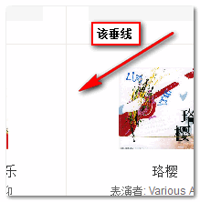
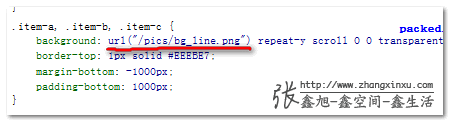

####base64：URL背景图片与web页面性能优化####
*	一、base64百科
>base64是网络上最常见的用于传输8bit字节代码的编码方式之一，可用于在HTTP环境下传递较长的表示信息。
>例如thunder://QUFodHRwOi8vd3d3LmJhaWR1LmNvbS9pbWcvc3NsbTFfbG9nby5naWZaWg==
>上面代码大家都熟悉吧，迅雷下载链接，就是base64编码后的地址，所以以后看到这种：一堆联系字母，最后1~2个“=”的代码就是base64.
>base64:url，就是url地址是base64编码的。
>
>例如下面这个
>
	

*	二、base64与文件数据编码
>在网络中，通过HTTP传输的文件可以通过base64对数据进行编码传输。就是上面的这个base64的gif格式的图片。当然，可以base64编码的文件不仅仅是图片，也可以是字体文件，例如（中间有缺省）
>
	@font-face{
	    font-family: forTest;
	    src: url(data:font/woff;charset=utf-8;base64,d09GRgABAAAAAAh4 ... RFERuENEGADl7JlY=) format('woff');
	}
自然，对于background-image图片，我们也可以使用base64编码进行传输，例如：
>
	background-image:url(data:image/gif;base64,R0lGODlhBAABAIABAMLBwfLx8SH5BAEAAAEALAAAAAAEAAEAAAICRF4AOw==);
>而使用base64编码作为background-imgae图片就是本文要着重阐述的。

*	三、如何获得图片的base64编码
>如下本地图片转换成可预览的base64编码的核心脚本
	var reader = new FileReader(), htmlImage;
	reader.onload = function(e) {
	    htmlImage = '';    // 这里e.target.result就是base64编码
	}
	reader.readAsDataURL(file);
>上面说的你只需要了解，实际上，目前base64编码工具不少吗，对于我们前端制作，下面这个图片base64编码获取页面是值得推荐的
>
>base64自动生成[点击这里](http://www.pjhome.net/web/html5/encodeDataUrl.htm "base64")
>该页面的原理就是上面所说的HTML5文件本地预览原理，具体可以自己查阅资料。

*	四、使用base64：URL的优缺点
>个人觉得base64：URL传输文件的好处在于：
>
1.	减少HTTP请求
2.	某些文件可以避免跨域的问题
3.	没有图片更新需要重新上传，还要清理缓存的问题
>
>不足之处：
>
1.	浏览器支持
使用base64编码图片作为背景图片的这种技术IE6/IE7浏览器是不支持的（IE9浏览器IE7某试下支持）。对于目前PC页面，兼容性问题是没有文件上传以及无需更新缓存的有点不复存在。
>
2.	增加了css文件的尺寸
base64编码图片本质上就是讲图片的二进制大小以一些字母的形式展现，例如一个1024字节的图片，base64编码后至少1024个字符，这个大小会被完全嵌入到css文件中（不过幸运的是也可以被gzip了，而图片文件被gzip效果不明显）。	
>
3. 编码成本
图片完成后还需要base64编码，目前估计手工完成的多，因此，增加了一定的工作量，虽然差不多。

*	五、优缺点权衡下的实际应用价值
>权衡上面所展示的优缺点，貌似base：url图片没有什么用武之地，实际上非也，有一种情况时用base64编码作为background-image背景图片远大于弊。何种情况呢？		
>在web页面制作的时候，由于某些原因，我们可能会用到下面这一类图片：
>
1.	这类图片不能与其他图片以CSS Sprite的形式存在，只能独行
2.	这类图片从诞生之日起，基本上很少被更新
3.	这类图片的实际尺寸很小
4.	这类图片在网站中大规模使用
>想想看，你的网站中有没有同事满足上面四条的背景图片？
>怎样，想到了没？提点下，例如下面这个企鹅微博中的loading gif图片（537字节，勉强算是）：537字节的实际大小还是算偏大了点，让我们看个更好的例子，大家可以去豆瓣首页，看看下图所示的垂直线：
>
>为background-image图片（for等高布局）
>
>从bg_line.png这样的命名可以预知（不是：home_bg_line.png），还背景图片会在（可以在）网站中多处使用
>图示平铺图片地址为：[http://img3.douban.com/pics/bg_line.png](http://img3.douban.com/pics/bg_line.png "豆瓣")
>大小1*1像素，png格式，大小88字节。（当图片颜色简单到应程度的时候，gif格式图片大小要小宇png，所以，这个点如果保存成gif格式，只需要43字节，为png一半大小）
>想这种图片大小绩效，但又占据一次请求，同事不能与其他背景图片Sprite，而网站很多地方都是用。因此，没有什么背景图片比这个更适合使用本文的base64：URL图片基数进行优化了！

文章转自张鑫旭大大[点击这里](http://www.zhangxinxu.com/wordpress/2012/04/base64-url-image-%E5%9B%BE%E7%89%87-%E9%A1%B5%E9%9D%A2%E6%80%A7%E8%83%BD%E4%BC%98%E5%8C%96/ "base64")
